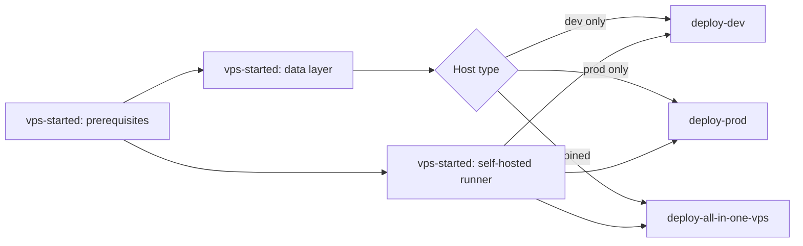

# Plys VPS deployment docs

Step-by-step guides for hosting the Plys platform on Ubuntu/Debian VPS hosts. Pick **one track** based on your target host.

## Tracks

| Track | When to use | Start here |
|-------|-------------|------------|
| **[vps-started](vps-started/README.md)** | Every VPS — packages, Node, Docker, `/apps`, runner, cleanup | [01-prerequisites](vps-started/01-prerequisites.md) |
| **[deploy-dev](deploy-dev/README.md)** | Dedicated **dev-only** VPS | [01-deploy](deploy-dev/01-deploy.md) |
| **[deploy-prod](deploy-prod/README.md)** | Dedicated **prod-only** VPS | [01-deploy](deploy-prod/01-deploy.md) |
| **[deploy-all-in-one-vps](deploy-all-in-one-vps/README.md)** | Single VPS with **dev + prod** | [01-deploy](deploy-all-in-one-vps/01-deploy.md) |

## Recommended order (any track)

1. **[Prerequisites](vps-started/01-prerequisites.md)** — system packages, Node 22, pnpm, PM2, Docker, `/apps`
2. **Data layer** — copy templates from [vps-started/infra](vps-started/infra/README.md) to `/apps`
3. **Deploy track** — dev, prod, or all-in-one guide
4. **[GitHub monorepo setup](deploy-dev/02-github-monorepos.md)** — environments + secrets on all three repos ([prod](deploy-prod/02-github-monorepos.md))
5. **[Self-hosted runner](vps-started/02-self-hosted-runner.md)** — org runner groups for CI deploys
6. **[Manual deploy](vps-started/05-manual-deploy.md)** — alternative when not using GitHub Actions

## Supporting guides

| Guide | Purpose |
|-------|---------|
| [Cleanup and reset](vps-started/03-cleanup-and-reset.md) | Full or partial teardown, DB/Redis volume reset |
| [Adminer + Redis Insight](vps-started/04-data-tools-adminer-redis.md) | Browser GUIs for Postgres/Redis |
| [OpenObserve monitoring](vps-started/06-monitoring-openobserve.md) | Logs, traces, metrics (dev and prod) |
| [OpenObserve KPI dashboards](openobserve-kpi-dashboards.md) | Importable SQL dashboards for four orgs (`internal-hub-api`, FE orgs) |
| [Infra templates](vps-started/infra/README.md) | `docker-compose` + `.env.data` for `/apps` |

## Domains (reference)

| Environment | Example hosts |
|-------------|---------------|
| Dev | `dev.ployos.com`, `dev.lonaos.com`, `dev.plyshub.space`, `db-dev.plyshub.space`, `observe-dev.plyshub.space` |
| Prod | `ployos.com`, `lonaos.com`, `plyshub.space`, `db.plyshub.space`, `observe.plyshub.space` |

See each deploy guide for the full hostname and port matrix.
