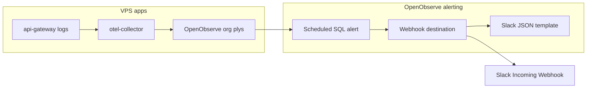

# OpenObserve KPI dashboards

Importable SQL dashboards for org **`plys`** on each VPS. They rely on structured log fields from the backend (`log_type`, `action`, `outcome`, `service_version`, etc.).

| Dashboard | File | Focus |
|-----------|------|--------|
| Platform KPIs | [`monitoring/dashboards/platform-kpis.json`](../monitoring/dashboards/platform-kpis.json) | Throughput, 5xx rate, latency, versions |
| Security & Audit | [`monitoring/dashboards/security-audit-kpis.json`](../monitoring/dashboards/security-audit-kpis.json) | Login funnel, admin actions, failed-login IPs |
| Business KPIs | [`monitoring/dashboards/business-kpis.json`](../monitoring/dashboards/business-kpis.json) | Withdrawals, webhooks, projects, notifications |

Regenerate JSON after editing panel definitions:

```bash
node scripts/generate-kpi-dashboards.mjs
```

---

## Prerequisites

1. Backend deployed with audit logging (Pino + `AppLogger.audit()`).
2. OpenObserve + OTEL collector running on the VPS ([`vps-started/06-monitoring-openobserve.md`](vps-started/06-monitoring-openobserve.md)) — collector must match PM2 log names (`{service}-out-{id}.log`).
3. Traffic after monitoring deploy (collector uses `start_at: end`; only **new** log lines are shipped).
4. At least 10+ minutes of traffic so panels have data.

---

## Import on dev (`observe-dev.plyshub.space`)

1. Sign in to **https://observe-dev.plyshub.space** with `huuphuc9410@gmail.com` and the dev `OPENOBSERVE_ROOT_PASSWORD`.
2. Confirm org **`plys`** is selected.
3. **Dashboards** → **New folder** → name **`plys-kpis`** (folder must exist before import — missing folder causes **422**).
4. For each JSON file in `monitoring/dashboards/`:
   - **Import** → upload the file.
   - Choose folder **`plys-kpis`**.
5. Open each dashboard and verify panels return rows (adjust time range to **Last 15 minutes** or **Last 1 hour**).

If import fails:

| Error | Fix |
|-------|-----|
| **Dashboard ID is required** / **missing layout.i** | Regenerate: `node scripts/generate-kpi-dashboards.mjs` — `layout.i` must be integer ≥ 1 (not `0`, not a string) |
| **422** on import | Same regenerate step; also ensure target folder exists in OpenObserve (**Dashboards → create `plys-kpis` folder** before import) |

---

## Import on prod (`observe.plyshub.space`)

Repeat the same steps on **https://observe.plyshub.space** using the **production** `OPENOBSERVE_ROOT_PASSWORD`. Dev and prod are separate instances — import on both after validating SQL on dev.

---

## Stream names

Panels query log streams by service name (e.g. `"api-gateway"`, `"identity-service"`). Cross-service panels use `"default"` with a `service` field filter.

If a panel is empty after import:

1. **Logs** → pick a stream → confirm field names (`log_type`, `action`, `service`, `status_code`).
2. Edit the panel SQL to match your stream layout (OTLP vs PM2 filelog may differ slightly).
3. Re-export from dev once tuned and re-import to prod.

---

## Useful log filters

| Goal | Filter |
|------|--------|
| Audit trail for a user | `log_type = 'audit' AND user_id = '<uuid>'` |
| Failed logins | `log_type = 'audit' AND action = 'login' AND outcome = 'failure'` |
| Deploy version mix | `SELECT service, service_version, COUNT(*) GROUP BY service, service_version` |
| HTTP errors | `log_type = 'access' AND status_code >= 500` |

---

## Alert: API 5xx rate → Slack

Send a Slack message when the **api-gateway** 5xx error rate exceeds a threshold. Uses the same semantics as the **5xx error rate %** panel in [Platform KPIs](monitoring/dashboards/platform-kpis.json).

Configure **dev** and **prod** separately — each OpenObserve instance (`observe-dev.plyshub.space` / `observe.plyshub.space`) needs its own Slack webhook, destination, and alert rule.



### Prerequisites

1. Monitoring stack running — [OpenObserve setup](vps-started/06-monitoring-openobserve.md) (org **`plys`**, OTEL collector ingesting PM2 logs).
2. [Platform KPIs imported on dev](#import-on-dev-observe-devplyshubspace); **5xx error rate %** panel returns data for stream **`api-gateway`**.
3. Access logs include structured fields **`log_type = 'access'`** and **`status_code`**. Phase 1 filelog may not expose these until backend OTLP / audit logging (Phase 2 in [06-monitoring-openobserve.md](vps-started/06-monitoring-openobserve.md#instrument-backend-services-phase-2)) — verify in **Logs** before creating the alert.
4. Two Slack channels (recommended): e.g. `#plys-alerts-dev` and `#plys-alerts-prod`. Store webhook URLs in a password manager — **never commit** them to git.

### Step 1 — Slack Incoming Webhook

**In Slack** (once per channel):

1. [Create a Slack app](https://api.slack.com/apps) (or reuse an existing ops app).
2. **Features → Incoming Webhooks** → toggle **On**.
3. **Add New Webhook to Workspace** → pick the channel (`#plys-alerts-dev` or `#plys-alerts-prod`).
4. Copy the webhook URL (`https://hooks.slack.com/services/...`).

Repeat for the second environment if dev and prod use different channels.

### Step 2 — Notification template (OpenObserve)

**In OpenObserve** (org **`plys`**) — repeat on dev and prod hosts:

1. **Management → Templates → Add Template**.
2. **Type:** Webhook.
3. **Name:** e.g. `SlackAlertPlys` (no spaces or special characters).
4. **Body** (Slack expects JSON with a `text` field):

```json
{
  "text": ":rotating_light: [{org_name}] {alert_name}\nStream: {stream_name}\nType: {alert_type}\nPeriod: {alert_period}\nThreshold: {alert_threshold}\nTriggered: {alert_trigger_time}"
}
```

5. **Save**.

Reference: [OpenObserve alert destinations](https://openobserve.ai/docs/user-guide/account-administration/management/alert-destinations/).

### Step 3 — Alert destination (Webhook → Slack)

1. **Management → Alert Destinations → Add Destination → Webhook**.
2. Fill in:

| Field | Dev example | Prod example |
|-------|-------------|--------------|
| **Name** | `SlackPlysDev` | `SlackPlysProd` |
| **Template** | `SlackAlertPlys` | `SlackAlertPlys` |
| **URL** | Dev Slack webhook URL | Prod Slack webhook URL |
| **Method** | `POST` | `POST` |

Destination names must not contain spaces, commas, or `: / ? #` (per OpenObserve rules).

3. **Save**. Use **Test** if the UI offers it — confirm a message appears in the Slack channel.

### Step 4 — Alert rule (scheduled SQL)

1. **Alerts → Add Alert → Scheduled**.
2. **General:**
   - **Name:** `API 5xx rate high` (or `API 5xx rate high - dev` / `- prod`)
   - **Folder:** `plys-kpis` (create under **Alerts** if needed)
   - **Stream type:** Logs
   - **Stream:** `api-gateway`
3. **Conditions → SQL** tab. Paste (do not use `SELECT *`):

```sql
SELECT
  100.0 * count(CASE WHEN status_code >= 500 THEN 1 END) / count(*) AS error_rate_pct,
  count(*) AS total_requests,
  count(CASE WHEN status_code >= 500 THEN 1 END) AS errors_5xx
FROM "api-gateway"
WHERE log_type = 'access'
HAVING error_rate_pct > 1.0 AND total_requests >= 10
```

The query returns **one row** when the 5xx rate exceeds **1%** with at least **10** requests in the evaluation window. Tune `1.0` and `total_requests` for your traffic (raise the minimum on prod to reduce noise).

4. **Threshold and schedule:**

| Setting | Dev | Prod |
|---------|-----|------|
| Check every | 5 minutes | 5 minutes |
| Period | Last 15 minutes | Last 15 minutes |
| Alert if row count | `>= 1` | `>= 1` |
| Silence / cooldown | 15–30 minutes | 15–30 minutes |
| **Destinations** | `SlackPlysDev` | `SlackPlysProd` |

5. **Save** and enable the alert.

Reference: [OpenObserve scheduled alerts](https://openobserve.ai/docs/user-guide/analytics/alerts/scheduled-alerts/).

### Step 5 — Verify

1. Confirm **Logs → `api-gateway`** has recent `log_type = 'access'` rows with `status_code`.
2. Open **Platform KPIs → 5xx error rate %** — chart should match alert logic.
3. Optionally trigger a test (temporary lower threshold, or known 5xx in dev).
4. Check **Alerts → History** for firings.
5. Confirm the Slack channel received the message.

Repeat Steps 2–5 on **prod** (`observe.plyshub.space`) with the prod webhook and `SlackPlysProd`.

### Troubleshooting

| Symptom | Fix |
|---------|-----|
| No Slack message | Test webhook URL with `curl -X POST -H 'Content-Type: application/json' -d '{"text":"test"}' '<webhook-url>'`; re-check destination name and template |
| Alert never fires | **Logs** → `api-gateway` — confirm `log_type` and `status_code` exist; lower `error_rate_pct` threshold temporarily on dev |
| Stream not found | Deploy apps + monitoring first; see [06-monitoring-openobserve.md](vps-started/06-monitoring-openobserve.md) |
| Repeated Slack spam | Increase silence / cooldown period |
| Dev alert on prod data | Each host is isolated — create separate rules on `observe-dev` vs `observe` |

---

## Other starter alerts

Use the same **Template → Destination → Alert** pattern as [above](#alert-api-5xx-rate--slack). Swap the SQL / filters:

| Alert | Stream | Condition (SQL / filter) |
|-------|--------|---------------------------|
| Login failure spike | `identity-service` | `log_type = 'audit' AND action = 'login' AND outcome = 'failure'` |
| Webhook failures | `finance-service` | `log_type = 'audit' AND event_category = 'finance' AND outcome = 'failure'` |

---

## Optional: API import

A follow-up script can POST dashboards via `POST /api/plys/dashboards` with the same Basic Auth used by the monitoring stack. Until then, use UI import.
